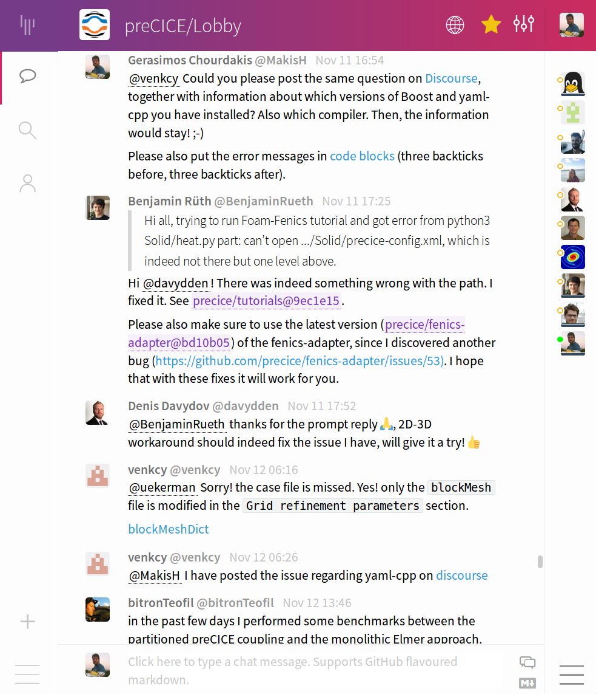
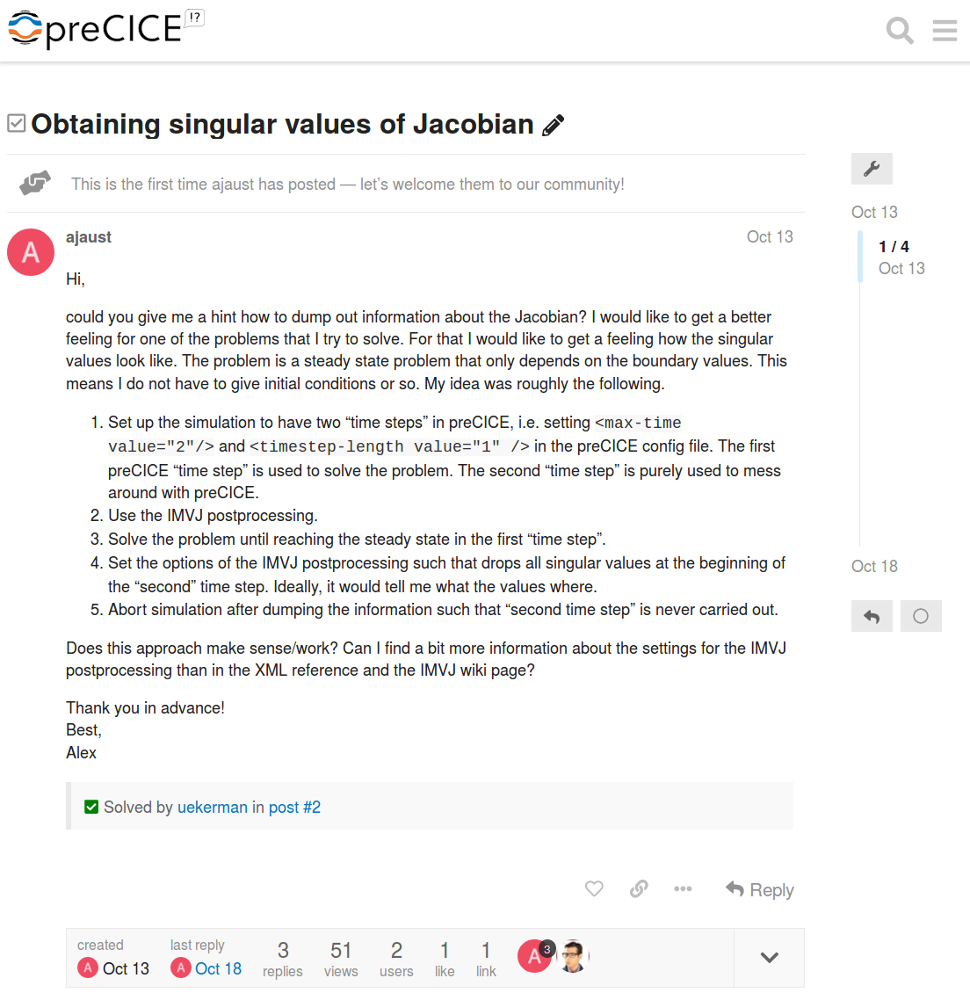
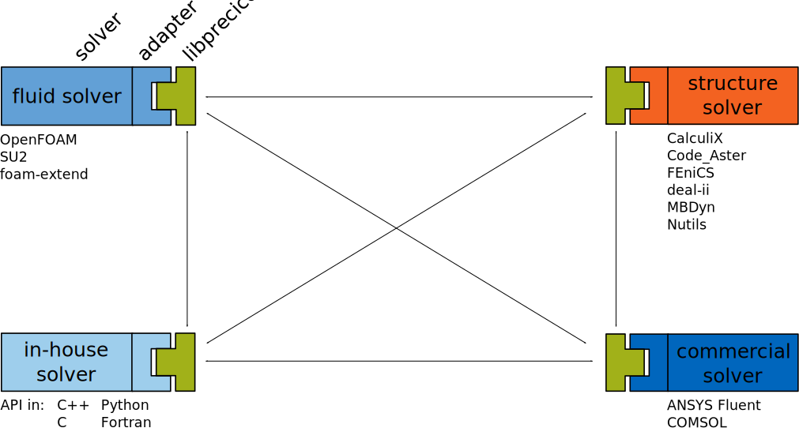

# Context

[preCICE](https://www.precice.org/) is a free C++ library that couples your simulations

<h3>Usually in RSE</h3>

- Developers are also users
- Domain experts

<h3 style="color:#0065BD">Our case</h3>

- We are not the target users
- Software/methods specialists
- Munich, Stuttgart, Eindhoven

---

# Why build a community?

---

<h3>Don't get users</h3>

- "It's just a prototype"
- "They will steal my work"
- No plans to continue
- No time to support them

<h3>Get users</h3>

- Feedback & contributions
- Citations (strong delay)
- Stronger proposals
- Industry funding
- Recruiting
- Career opportunities

Community dream: Users help each other

---

## It's motivating!

> After the amount of support I received from this community, I am switching to opensource for every one of my needs.

<small><a href="https://precice.discourse.group/t/openfoam-adapter-precice-as-a-static-or-as-a-shared-library/78/3?u=makish">@nithinadidela on Discourse</a></small>

---

# Get your first users

---

## Don't do

- Develop unimportant features
- Convince developers of similar tools
- Go only to conferences in your field

---

<h2>Do</h2>

- Add missing components
- Ready-to-use packages
- Easy documentation
- Simple tutorials

- Go to domain conferences
- Jump on existing trains
- Interview users and adapt
- Find your audience & USPs
- Find the right language

Develop the right thing, communicate it right

---

# Communication is crucial

---

## Communication barrier

- Advertise channels to reach you
- Be active on these channels

Notes:
- Explain what you need and how to get it

---

## Direct communication

<ul style="list-style: none">
<li> <i class="fa fa-smile" style="color:green"></i> Low barrier</li>
<li> <i class="fa fa-frown" style="color:red"></i> Does not scale</li>
<li> <i class="fa fa-frown" style="color:red"></i> Repeat for every similar case</li>
</ul>

---

## Mailing list

<ul style="list-style: none">
<li> <i class="fa fa-smile" style="color:green"></i> Low barrier (?)</li>
<li> <i class="fa fa-smile" style="color:green"></i> Reach inactive users</li>
<li> <i class="fa fa-frown" style="color:red"></i> Fear of bothering</li>
<li> <i class="fa fa-frown" style="color:red"></i> Non-searchable (?)</li>
<li> <i class="fa fa-frown" style="color:red"></i> A thing of the past (?)</li>
</ul>

---

## Chatroom

<ul style="list-style: none">
<li> <i class="fa fa-smile" style="color:green"></i> Low barrier</li>
<li> <i class="fa fa-meh" style="color:gray"></i> Some users stay</li>
<li> <i class="fa fa-frown" style="color:red"></i> Chaotic</li>
<li> <i class="fa fa-frown" style="color:red"></i> Non-searchable</li>
</ul>

Different kind of questions in chatroom: you need both!

---

## Forum

<ul style="list-style: none">
<li> <i class="fa fa-smile" style="color:green"></i> Structured</li>
<li> <i class="fa fa-smile" style="color:green"></i> Searchable</li>
<li> <i class="fa fa-smile" style="color:green"></i> Also serves as FAQ</li>
<li> <i class="fa fa-meh" style="color:gray"></i> Some users stay</li>
<li> <i class="fa fa-meh" style="color:gray"></i> Higher barrier</li>
</ul>

<small>Disclaimer: We only recently started with this</small>

---

# From user to contributor

---

## Make it easy

- Advertise where the development is done
  - Choose mainstream platforms
  - Don't require logging in to see the code
  - Don't "code available under request"
- Document architecture
- Setup CI / CD
- Stick to standards

Welcome the tiniest contribution!

Notes: 
- Where do you need help?
- Engage on GitHub

---

## Split components

- Easier to contribute to smaller codebase
- Isolated potential damage
- Might solve license issues

Notes:
- Approaches: library, plug-ins
- Each component can be a student project

---

## preCICE ecosystem

Notes:
- If you remember one thing

---

## Give motives

- Visibility
- Shared ownership

---

# Good community metrics?

---

## Followers: interested in preCICE

<canvas data-chart="line" data-chart-src="data/followers.csv">
<!-- 
{
"data" : {
"datasets" : [
  { "borderColor": "#0065BD", "backgroundColor": "#0065BD", "fill":"false" },
  { "borderColor": "#E37222", "backgroundColor": "#E37222", "fill":"false" },
  { "borderColor": "#98C6EA", "backgroundColor": "#98C6EA", "fill":"false" },
  { "borderColor": "#A2AD00", "backgroundColor": "#A2AD00", "fill":"false" }
  ]
},
"options": { "responsive": true, "scales": { "xAxes": [{ "stacked": false }], "yAxes": [{ "stacked": false }] } },
"options": {"scales": {"yAxes": [{"ticks": { "beginAtZero": true }}]}},
"options": {"animation": false}
}
-->
</canvas>

scale max: 160 (cumulative)

Note: How do you measure your community?

vvv

## Traffic: discovered preCICE

<canvas data-chart="line" data-chart-src="data/views.csv">
<!-- 
{
"data" : {
"datasets" : [
  { "borderColor": "#0065BD", "backgroundColor": "#0065BD", "fill":"false" }
  ]
},
"options": { "responsive": true, "scales": { "xAxes": [{ "stacked": false }], "yAxes": [{ "stacked": false }] } },
"options": {"scales": {"yAxes": [{"ticks": { "beginAtZero": true }}]}},
"options": {"animation": false}
}
-->
</canvas>

scale max: 500 (per two weeks)

vvv

## Git clones: trying preCICE from source

<canvas data-chart="line" data-chart-src="data/clones.csv">
<!-- 
{
"data" : {
"datasets" : [
  { "borderColor": "#0065BD", "backgroundColor": "#0065BD", "fill":"false" }
  ]
},
"options": { "responsive": true, "scales": { "xAxes": [{ "stacked": false }], "yAxes": [{ "stacked": false }] } },
"options": {"scales": {"yAxes": [{"ticks": { "beginAtZero": true }}]}},
"options": {"animation": false}
}
-->
</canvas>

scale max: 120 (per two weeks, bots included)

vvv

## Binary package downloads

<canvas data-chart="bar" data-chart-src="data/deb.csv">
<!-- 
{
"data" : {
"datasets" : [
  { "stack": "deb", "borderColor": "#0065BD", "backgroundColor": "#0065BD", "fill":"false" },
  { "stack": "deb", "borderColor": "#98C6EA", "backgroundColor": "#98C6EA", "fill":"false" },
  { "stack": "deb", "borderColor": "#64A0C8", "backgroundColor": "#64A0C8", "fill":"false" }
  ]
},
"options": { "responsive": true, "scales": { "xAxes": [{ "stacked": true }], "yAxes": [{ "stacked": true }] } },
"options": {"scales": {"yAxes": [{"ticks": { "beginAtZero": true }}]}},
"options": {"animation": false}
}
-->
</canvas>

scale max: 400 (cumulative)

---

## Community engagement

| Repository         | Contrib. | External | <i class="fa fa-star"></i> | <i class="fa fa-code-branch"></i> |
| :---               |  ---:    | :---     | :---: | :---: |
| precice            | 24       | 5 (21%)  | 148   | 50    |
| openfoam-adapter   | 6        | 2 (33%)  | 46    | 22    |
| calculix-adapter   | 7        | 1 (14%)  | 7     | 23    |
| mbdyn-adapter      | 3        | 2 (67%)  | 1     | 3     |<!--- .element: style="font-size:6pt" -->

<small>Too small numbers to conclude</smal>

---

## Community engagement

| Pull requests      | PR   | External | Issues | External     |
| :---               | ---: | :---     | ---:   | :---     |
| precice            | 259  | 10 (4%)  | 306    | 53 (17%) |
| openfoam-adapter   | 33   | 12 (36%) | 67     | 18 (27%) |
| calculix-adapter   | 6    | 3 (50%)  | 15     | 5  (33%) |
| mbdyn-adapter      | 1    | 1 (100%) | 0      | 0        |

<small>Too small numbers to conclude</smal>

Notes:
- Statistics obtained manually, but there is also a GitHub API
- Is there any nice ready-to-use tool for this?

---

## More metrics

- Activity on channels
- Citations
- Activity on channels

vvv

## Activity on channels

  - Gitter: 5 messages / day -- 14 active users / month
  - Discourse: 3 posts / day (just started)
  - Mailing list: 1 email / 2 days

vvv

## Citations

<canvas data-chart="line" data-chart-src="data/citations.csv" style="margin-top:25pt">
<!-- 
{
"data" : {
"datasets" : [
  { "borderColor": "#0065BD", "backgroundColor": "#0065BD", "fill":"false" },
  { "borderColor": "#98C6EA", "backgroundColor": "#98C6EA", "fill":"false" }
  ]
},
"options": { "responsive": true, "scales": { "xAxes": [{ "stacked": false }], "yAxes": [{ "stacked": false }] } },
"options": {"scales": {"yAxes": [{"ticks": { "beginAtZero": true }}]}},
"options": {"animation": false}
}
-->
</canvas>

[Main preCICE paper](https://www.sciencedirect.com/science/article/abs/pii/S0045793016300974) (2016): 61 total citations

Notes:
- Citation numbers lower than in other fields

vvv

## Collaborations (which?)

- Known users: 24 academic & 9 industrial groups
- Testimonials: 11

Notes: Important to know (some of) your users!

---

# Summary

  Help the users help themselves!

  <small>preCICE website: <a href="https://www.precice.org">www.precice.org</a> - Twitter: <a href="https://twitter.com/preCICE_org">@preCICE_org</a></small>
  
  <small>Gerasimos Chourdakis (TUM)  Benjamin Uekermann (TU/e)  + many more</small>
  
  <small> This work is licensed under a <a rel="license" href="http://creativecommons.org/licenses/by/4.0/">Creative Commons Attribution 4.0 International License</a>.</small>

 <i class="fa fa-comments"></i> Come to our poster (preCICE, sustainability, ...) 

